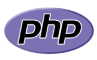
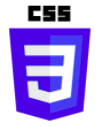
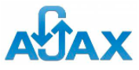
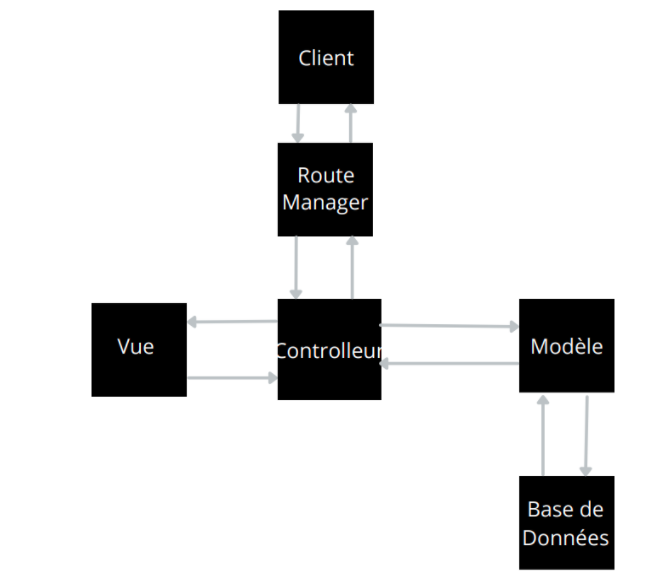
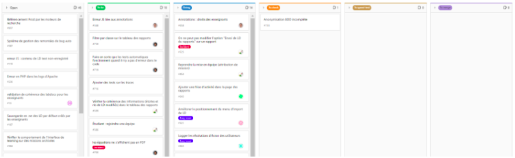
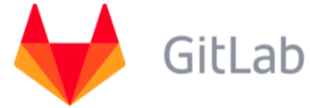
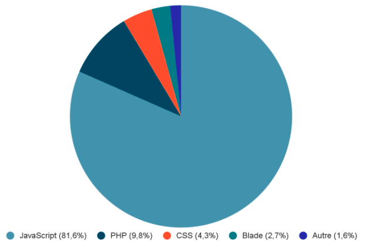

# Rapport Groupe LabnBook

## Etudiants :

- CIRSTEA Paul
- SOULARD Alexandre
- TONDEUX Emilie
- YUNG Kevin

## Qu’est-ce que LabnBook ?

C’est un cahier numérique partagé permettant d’effectuer des travaux concernant les sciences de façon plus pratique, principalement pour les lycéens et étudiants du supérieur. C’est un outil comprenant des espaces structurés par les enseignants, afin d’écrire collaborativement, de façon synchrone ou pas, des rapports de projet, cahiers de laboratoire, ou comptes-rendus de travaux pratiques. Cet outil facilite également le travail à distance.

### Sujet :

Le sujet du projet est la participation à la vie du logiciel : la correction de bugs et l'ajout de nouvelles fonctionnalités. Pour travailler là-dessus, nous avons travaillé en méthodologie agile.

### Technologies utilisées :

- Javascript

Le Javascript a été utilisé afin de pouvoir manipuler les données récupérées soit à l’aide d’une requête Ajax soit avec l'interaction de l’utilisateur avec le logiciel. Cela permet de créer du contenu mis à jour de façon dynamique et de le contrôler. Le traitement des données permet ensuite de les afficher avec le PHP et l’HTML.

- PHP

Le PHP permet d’afficher les données de façon pratique, en alliant les boucles et le traitement des données à afficher (au préalable traitées avec le Javascript) avec l’HTML. En effet, comme l’HTML ne permet pas de faire, par exemple, des boucles for, alors avec le PHP cela est possible et permet donc d’afficher toutes les données d’un tableau facilement.

- HTML

L’HTML est un langage de balises et est utilisé pour structurer et donner un sens au contenu web, 
Elle permet l’affichage des données sur chaque page du logiciel.

- CSS

Le CSS est un langage de règles de style permettant la mise en forme de l’affichage des données du contenu html, afin que le visuel soit propre.

- Ajax (pour certains d'entre nous)

Permet de faire des requêtes à la base de données et de récupérer les données afin de pouvoir les transmettre au Javascript qui va donc les traiter.

- Laravel (pour certains d'entre nous)

Permet de faciliter l’appel à Ajax, en rendant les requêtes plus visuelles et plus faciles à comprendre et à modifier par la suite.

## Architecture :

L’architecture est basée sur le modèle MVC (modèle vue contrôleur). Le route manager permet de parser le chemin auquel veut accéder le client et d’envoyer les informations au contrôleur, qui va charger la vue adéquat ainsi que les données nécessaire à l’affichage, en les demandant au modèle, qui va lui-même demander ce qui est nécessaire à la base de données.

## Réalisations techniques : 

Bugs corrigés sur le logiciel :
Bug d’affichage de certaines images, dépassement du cadre dans lequel les images se trouvent
L’affichage de certaines pop-up ne se faisait pas au bon endroit, ainsi cela pouvait gêner la visualisation de ce qui est écrit dedans.
L’affichage de l’importation de documents sur la plateforme ne se faisait pas correctement, il se pouvait que le nom des documents soient tronqués

Fonctionnalités développées sur le logiciel :
Pour chaque mission des élèves : affichage des noms des professeurs en lien avec la mission
Affichage de frises pour permettre aux professeurs de suivre ce qu’ont fait les élèves
Changement d’un menu de la plateforme afin qu’il soit plus agréable à utiliser
Ajout d’un bouton pour afficher le profil de chaque étudiants dans le menu de l’interface étudiant
Récupérer les résolutions d’écrans des utilisateurs qui se connectent à la plateforme
Amélioration de l’ergonomie de certaines fenêtres du logiciel
Ajout d’un champ de recherche pour permettre aux étudiants de rechercher une mission en particulier parmi toutes celles qu’ils ont
Ajout la possibilité pour un enseignant de supprimer un document importé

## Gestion de projet :

Pour le projet nous avons travaillé en méthodologie agile. Nous avons fait des sprint agile d'une semaine. A chaque début de sprint nous avons regardé l'avancement des différents membres du projet et les difficultés rencontrées et celles encore qui posent problème. Ensuite, pour la répartition des tâches/du travail, nous avons procédé avec la méthode agile Kanban, si un des membres ou plus n'avait pas de tâche en cours, nous regardions le tableau des différentes issues à réaliser et nous choisissions celle(s) que nous voulions réaliser. Ces issues ont été créées par les porteurs du projet ainsi que ceux travaillant à temps plein sur le projet.

Pour gérer toutes les tâches nous avons utilisé un Kanban (dont vous pouvez voir une image ci-dessous) :

Cette méthode Kanban fonctionne à partir de cartes, chaque carte représente une tâche à accomplir au vue de la demande du projet et du client. Cela a donc permis de visuellement comprendre rapidement l’état d’avancement du projet. Ici sur l’image ci-dessus, on remarque plusieurs parties : “Open”, “To do”, “Doing”, “To check”, “To speedtest”, “To merge”. Pour ceux qui avaient déjà avancé sur leur tâche alors, avec les porteurs du projet, nous regardions l'avancée et ce qui était améliorable et si ça convenait par rapport à ce qui était initialement demandé.

Nous n'avions pas de planning prévisionnel à proprement parler car nous avancions à notre rythme. Nous voulions au moins terminer nos différentes tâches, celles commencées, avant la fin du projet. Cependant pour Emilie et Alexandre ça s'est annoncé plutôt difficile à cause de leur dernière tâche, qui s'est avérée plus difficile que prévu.

SOULARD Alexandre était le chef de projet et TONDEUX Emilie était le scrum master. Nous étions tous les 4 des développeurs dans le projet, et nos tâches étaient sensiblement de même difficulté.

## Outils utilisés :

Pour faire toute la gestion du projet nous avons utilisé :

- GitLab 

Cet outil permet la création de tâches, l’attribution de ces tâches et de discuter avec les porteurs du projet. 

- Discord

Nous avons aussi utilisé Discord, logiciel de messagerie, afin de pouvoir communiquer entre membres du projet mais aussi avec un des porteurs du projet, afin de faciliter la communication entre nous tous.

Pour ce qui concerne le code, nous avons utilisé :

- Visual Studio Code

Visual Studio Code est un éditeur de code et permet de programmer dans n’importe quel langage de façon efficace.

- PhpStorm

PhpStorm est aussi un éditeur de code. Cependant, il est bien plus utile que Visual Studio Code pour tout ce qui concerne le débogage. En effet, il y a un plug-in ajoutable au navigateur afin de relier PhpStorm et le débogueur et ainsi faciliter le débogage quand il y en a besoin.

## Métriques logiciels :

Répartition des lignes de code par membre du projet : (le nombre de commits à revérifier et faut ajouter le nombre de lignes de code)

- CIRSTEA Paul :
    - 6 Commits
    - 437 Lignes de codes ajoutées

- SOULARD Alexandre :
    - 34 Commits
    - 1 695 Lignes de codes ajoutées

- TONDEUX Emilie :
    - 34 Commits
    - 3 138 Lignes de codes ajoutées

- YUNG Kevin :
    - 10 Commits
	- 568 Lignes de codes ajoutées

## Répartition des langages utilisés dans le projet :

Dans le diagramme ci-dessous, “Blade” permet de générer du HTML côté serveur en PHP, donc la part de Blade contient du HTML. Nous pouvons voir que le projet est principalement constitué de JavaScript. En effet, le traitement des données représente une très grande partie de la programmation, tandis qu’en général l’affichage se fait en quelques lignes. Cependant, pour le JavaScript, la quantité marquée dans ce diagramme comprend les librairires importées donc le projet contient moins de JavaScript mais cela reste quand même le langage le plus utilisé dans le projet.

## Conclusion (Retour d'expérience) :

Lors de ce projet nous avons beaucoup appris, que ça soit sur le travail en équipe avec une équipe déjà formée et bien ancrée dans le projet, mais aussi sur le fait d’entrer dans un projet déjà bien commencé et dont le code est assez conséquent. Nous avons trouvé très enrichissant de contribuer à un logiciel utilisé par des personnes (3 500 utilisateurs par an).
Au début c’était compliqué de se mettre dans le code, car le code déjà présent est assez conséquent et donc nous nous sommes assez facilement perdu dans l’architecture des dossiers. Mais après une semaine nous avons commencé à être assez familiarisé avec le code et la structure du code et c’était plus facile de pouvoir faire les tâches qui nous avaient été attribuées.

Les discussions avec le chef du projet étaient assez compliquées car on devait passer par les messages dans les issues sur Gitlab et donc c’était parfois un peu long. Cependant nous avons fait de notre mieux et nous nous en sommes finalement plutôt bien tirés car nous avons eu toutes les réponses à nos questions afin de pouvoir continuer nos tâches sans être inquiétés par le temps.

## Glossaire

- Issue : Terme utilisé pour représenter une tâche à réaliser sur Gitlab ainsi que sur Github.

- Sprint agile : Durée au cours de laquelle chaque collaborateur a des tâches à effectuer, pour les présenter à la fin de cette durée. Au début de ce temps imparti, tous les collaborateurs se réunissent afin de partager les tâches à réaliser et de se mettre d’accord sur le temps nécessaire pour réaliser chaque tâche demandée.

- Porteur de projet : Personne qui représente le projet auprès de notre groupe.

- Scrum master : Personne qui s’occupe, lors de l’utilisation d’une méthodologie agile, de la communication dans le groupe de travail et qui veille à ce que tout se passe bien, niveau relationnel, entre les membres du groupe.

- Gitlab : plateforme utilisée pour faciliter la gestion d’un projet.

- Discord : logiciel permettant de communiquer facilement avec d’autres personnes.

- Phpstorm et Visual Studio Code : logiciels utilisés principalement pour écrire du code.

- Kanban : tableau qu’on retrouve par exemple sur GitLab ou Github et qui permet de gérer facilement les tâches du projet, en les plaçant dans certaines catégories (Open, To do, Doing, To check, To merge, Closed).

## Bibliographie

- Documentation de Laravel : https://laravel.com/docs/

- Documentation D3JS : https://d3js.org/

## Annexes

Visualisations des fonctionnalités implémentées :

_Fonctionnalité implémentée par Alexandre et Emilie : affichage de traces de travaux d’étudiants_  

_Fonctionnalité implémentée par Emilie : affichage des noms des tuteurs de chaque mission_  

_Fonctionnalité implémentée par Kevin : ajout d’un bouton pour afficher le compte d’un utilisateur dans ce menu_  

_Fonctionnalité implémentée par Alexandre : ajout d’un champ de recherche pour les missions_  

  

Image de gauche c'était avant et l'image de droite c'est maintenant

_Fonctionnalité Développée par Alexandre : amélioration de l’affichage des documents à importer_  
